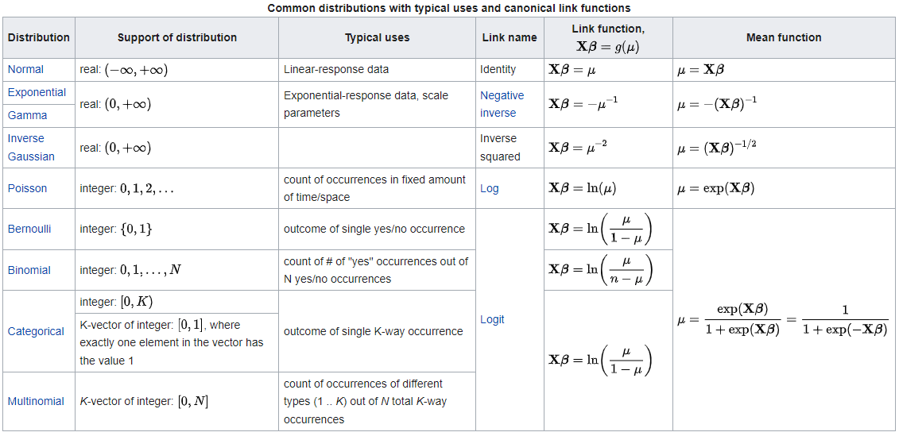

# Modelos Lineales Mixtos

Podemos, en vez de ajustar un único modelo, aplicar modelos asociado a determinadas caracteristicas. Una desventaja es que esto tiende a aumentar exponencialmente la cantidad de parámetros. Se multiplica el numero de veces que se utilizan los datos, lo que aumenta los grados de libertad. Esto signfica que si yo hago multiples modelos a partir de un mismo set de datos se tiende a aumentar la probabilidad de cometer error del tipo 1.

> Solución: Incorporar un factor de efectos aleatorios. Un modelo mixto incorpora factores fijos y aleatorios. El coeficiente aleatorio es el que va variando conforme varí­a la clase. Los coeficientes fijos no varí­an.

```{r Packages}

library(tidyverse)

renv::install()

```

------------------------------------------------------------------------

### Supuestos MRL

En orden de importancia:

1.  **Normalidad** de residuos
2.  **Homocedasticidad**
3.  **Multicolinearidad** (independencia de variables)
4.  **Autocorrelación** de errores (independencia de observaciones)
5.  Datos atípicos (*outliers*)

------------------------------------------------------------------------

## Datos

```{r Arboles.csv}

data <- read_csv("~/Casanova/Estudio Personal/Metodos_Estadisticos_RRNN/Talleres/Taller4/data/Arboles.csv")

attach(data)

glimpse(data)

```

## CRITERIOS DE INFORMACIÓN

AIC se puede emplear para comparar distintos tipos de modelos. Log likelihood esta en función de funcion de distribución de probabilidad. Puedo comparar distintos modelos, incluso si presentan distintos predictores o que sean de distinto tipo.

Los criterios de información buscan la parsimonía mediante:

-   Explica la mayor cantidad de variabilidad con la menor cantidad de predictores posibles

-   Verosimilitud: Evalúa la similitud/complejidad (transformaciones)

### Cuando ocupar IC

En los MLM se emplean los criterios de información pero tambien se ocupan métricas de ajuste comunes.

# Devianza

Desviaciones del modelo con respecto a sí mismo. Deviance es una medida del poder predictivo del modelo. Existe la nula y residual, la residual debiese ser lo menor posible (cercana a 0) la devianza nula es el valor si es que el estimador es en base a la media de la variable respuesta.

-   Devianza **nula**: No hacer nada, que el modelo sea el promedio. La predicción es el promedio de la variable respuesta (y), es decir, no se toma en cuenta ningún predictor.

-   Devianza **residual**: El efecto del modelo sobre el predictor. Si la devianza residual es más cercana a cero significa que el modelo es mejor.

# Familias

-   *Gamma* e *inverse.gaussian* podemos aplicarlas a variables continuas restringiendo a valores únicamente positivos.

    -   *Gamma*: Utiliza la **inversa negativa** de la variable y (multiplica por -1 y eleva por -1).

    -   *inverse.gaussian*: Utiliza el **cuadrado de la inversa** de la variable respuesta (eleva la variable por -2).

-   *poisson* y *binomial.negativa* se ocupan para variables de conteo.

    -   *binomial.negativa* se emplea cuando existen muchos ceros, lo que afecta a la distribución *poisson*.

-   *binomial* es para probabilidades (valores entre 0 y 1). Puede extenderse a modelos multinomiales.



## Evaluación del modelo

Generalmente, se emplea devianza en conjunto con MAE para los modelos de regresión. Los modelos de clasificación se evalua mediante matriz de confusión y curva ROC.

## Curva ROC

Permite determinar el umbral sobre el cual un glm con familia binomial el resultado es uno u lo otro.

El modelo
